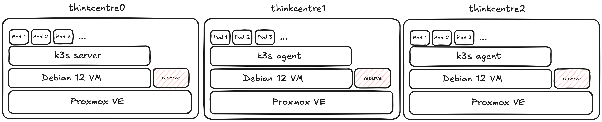
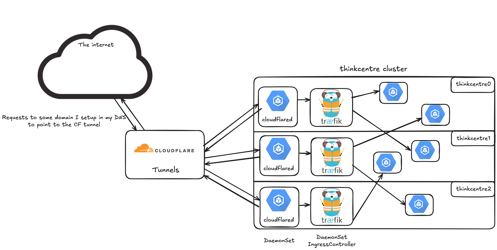

# My Homelab

## Hardware

The current configuration consists of 3 ThinkCentre M715q Tiny mini computers.

| Node name | CPU | RAM | Disk space |
| --- | --- | --- | --- |
| thinkcentre0 | AMD Ryzen 3 2200GE | 8 GB (1x8) | 240 GB |
| thinkcentre1 | AMD Ryzen 3 2200GE | 16 GB (1x16) | 240 GB |
| thinkcentre2 | AMD Ryzen 3 2200GE | 16 GB (1x16) | 120 GB |

Cost breakdown:

| Item | Cost | Currency |
| --- | --- | --- |
| 3 x thinkcentre (without RAM and storage) | 229.70 | € |
| 8 GB RAM stick | 300.00 | Kč (~ 13 €) |
| 2 x 240 GB SSD | 1000.00 | Kč (~ 40 €) |

The rest of the hardware I had lying around not being used.

## Software (OS)
- All of the nodes are running [Proxmox VE](https://www.proxmox.com/en/products/proxmox-virtual-environment/overview).
- Each node hosts a single [Debian](https://www.debian.org/) stable VM with most of the node's resources allocated to it.

The node `thinkcentre0` runs the [K3s](https://k3s.io/) Kubernetes distribution server instance. The cluster does not run [etcd](https://etcd.io/), instead it uses the K3s' built-in SQLite data store.

The other 2 nodes run agent instances.

This setup is heavily influenced and also highly motivated by: [Dreams of Autonomy's Youtube video](https://www.youtube.com/watch?v=2yplBzPCghA)
@elliottminns

## Software (userland services?)

The rest of the setup can be seen in the files in this repository. Mainly `helmfile.yaml`.
This respository mainly takes care of the _architecture_ of the cluster, application deployment is done with [ArgoCD](https://argo-cd.readthedocs.io/en/stable/).

The _architecture_ part of the cluster consists of:
- A MariaDB instance (deployed via [MariaDB k8s operator](https://github.com/mariadb-operator/mariadb-operator)),
- [Longhorn](https://longhorn.io/) block storage system,
- [Traefik](https://doc.traefik.io/traefik/) internal and public Ingress Controllers,
- the `cloudflared` Tunnels connector,
- and more...

## TODOs
- [Gitea](https://about.gitea.com/) instance for CI/CD and a container image repository,
- better storage solution (external NAS with RAID; shared via NFS?),
- [NextCloud](https://nextcloud.com/), [Matrix server](https://matrix.org/), [Fediverse](https://en.wikipedia.org/wiki/Fediverse) stuff?,
- improved logging and alerting (there's almost none currently),
- a rack with better cooling / power management and monitoring, smart outlets?,
- actually use it for projects :D.

