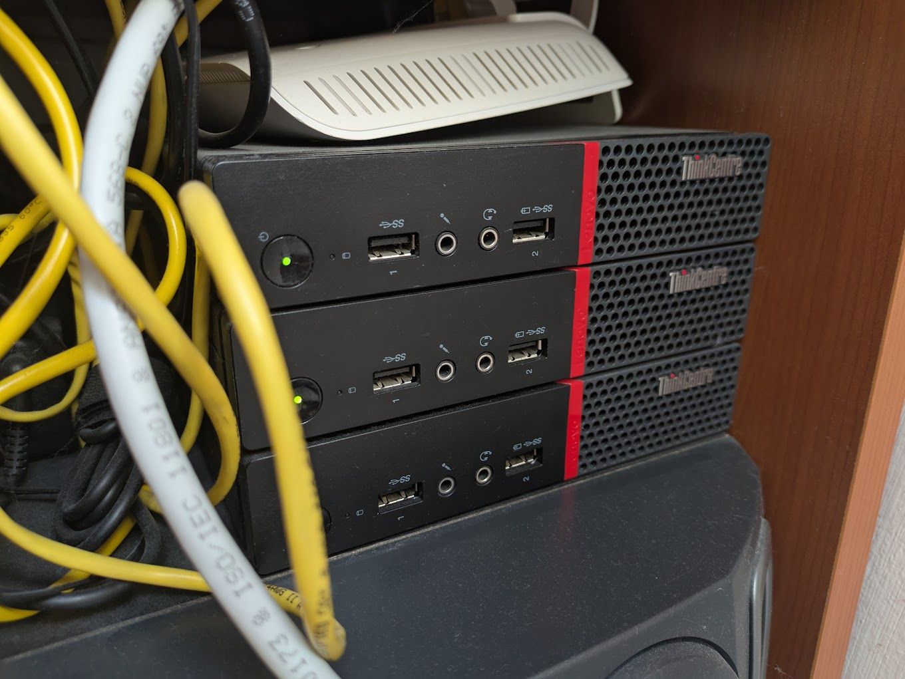

# My Homelab

## Hardware

The current configuration consists of 3 ThinkCentre M715q Tiny mini computers.

| Node name | CPU | RAM | Disk space |
| --- | --- | --- | --- |
| thinkcentre0 | AMD Ryzen 3 2200GE | 8 GB (1x8) | 240 GB |
| thinkcentre1 | AMD Ryzen 3 2200GE | 16 GB (1x16) | 240 GB |
| thinkcentre2 | AMD Ryzen 3 2200GE | 16 GB (1x16) | 120 GB |

Cost breakdown:

| Item | Cost | Currency |
| --- | --- | --- |
| 3 x thinkcentre (without RAM and storage) | 229.70 | € |
| 8 GB RAM stick | 300.00 | Kč (~ 13 €) |
| 2 x 240 GB SSD | 1000.00 | Kč (~ 40 €) |

The rest of the hardware I had lying around not being used.
